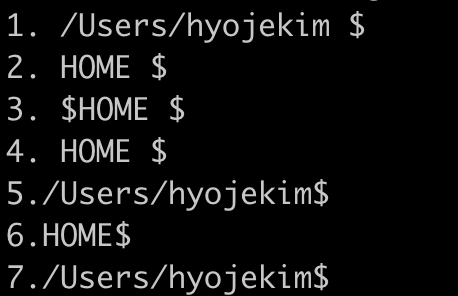

# Lexer: 구문 분석

## bash-parser 분석하기

### `“`과 `‘`로만 감싸져있거나 없을 때

```c
echo 1." $HOME " 2." HOME " 3.' $HOME ' 4.' HOME ' 5.$HOME 6.HOME 7.${HOME}
```

```c
/* tokens */
[ 0] 💬 WORD    echo
[ 1] 💬 WORD    1." $HOME " - expansion(3,7)
[ 2] 💬 WORD    2. HOME 
[ 3] 💬 WORD    3. $HOME 
[ 4] 💬 WORD    4. HOME 
[ 5] 💬 WORD    5.$HOME - expansion(2,6)
[ 6] 💬 WORD    6.HOME
[ 7] 💬 WORD    7.${HOME} - expansion(2,8)
```



### `“`과 `‘`로 감싸진 문자열이 중간에 하나만 있을 때

```c
echo 1.hello" $USER "world
echo 2.hello" USER "world
echo 3.hello' $USER 'world
echo 4.hello' USER 'world
echo 5.hello_$USER_world
echo 6.hello_USER_world
echo 7.hello_${USER}_world
```

```c
echo 1.hello" $USER "world 2.hello" USER "world 3.hello' $USER 'world 4.hello' USER 'world 5.hello_$USER_world 6.hello_USER_world 7.hello_${USER}_world
```

```c
/* tokens */
[ 0] 💬 WORD     echo
[ 1] 💬 WORD     1.hello" $USER "world - expansion(9, 13)
[ 2] 💬 WORD     2.hello USER world
[ 3] 💬 WORD     3.hello $USER world
[ 4] 💬 WORD     4.hello USER world
[ 5] 💬 WORD     5.hello_$USER_world - expansion(8, 18)
[ 6] 💬 WORD     6.hello_USER_world
[ 7] 💬 WORD     7.hello_${USER}_world - expansion(8, 14)
```

.png>)

``

### `“`과 `‘`로 감싸진 문자열이 여러개 존재할 때

```c
echo 1."$USER"---"USER"---"$USER"---"USER"
echo 2.'$USER'---'USER'---'$USER'---'USER'
echo 3.'USER'---"$USER"---"USER"---'$USER'
echo 4.$USER---"$USER"---'$USER'---${USER}
echo 5.$USER42---"$USER"---'$USER'---${USER}42
```

```c
/* tokens */
[ 0] 💬 WORD     echo
[ 1] 💬 WORD     1."$USER"---"USER"---"$USER"---"USER"
										expansion(3, 7, 22, 26)

[ 0] 💬 WORD     echo
[ 1] 💬 WORD     2.$USER---USER---$USER---USER

[ 0] 💬 WORD     echo
[ 1] 💬 WORD     3.'USER'---"$USER"---"USER"---'$USER'
										expansion(12, 16)

[ 0] 💬 WORD     echo
[ 1] 💬 WORD     4.$USER---"$USER"---'$USER'---${USER}
										expansion(2, 6, 11, 15, 30, 36)

[ 0] 💬 WORD     echo
[ 1] 💬 WORD     5.$USER42---"$USER"---'$USER'---${USER}42
										expansion(2, 8, 13, 17, 32, 38)
```

.png>)

### 번외

```c
echo $TEST$TEST=lol$TEST""lol
```

```c
/* tokens */
[ 0] 💬 WORD     echo
[ 1] 💬 WORD     $TEST$TEST=lol$TEST""lol
									expansion(0, 4, 5, 9, 14, 18)
```

.png>)
